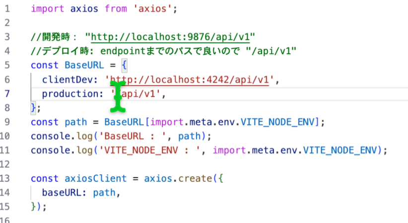

### server

1. package-json の作成

```js
npm init
```

1. dependencies の追加
   下記インストール
   "cors": "^2.8.5",
   "dotenv": "^16.3.1",
   "ejs": "^3.1.9",
   "express": "^4.18.2",
   "knex": "^3.0.1",
   "nodemon": "^3.0.2",
   "pg": "^8.11.3"

1. devDependencies の追加

```js
npm i --save-dev chai eslint mocha
```

1. scripts の追加

```js
    "test": "mocha --exit",
    "start": "nodemon index.js",
    "makeMigration": "knex migrate:make",
    "migrate": "knex migrate:latest",
    "makeSeed": "knex seed:make",
    "seed": "knex seed:run",
    "build": "npm i && npm run migrate && npm run seed"
```

1. knex の接続設置ファイルの作成

```js
npx knex init
```

1. マイグレーションファイルを作る

```js
npm run makeMigration create_task_table
```

1. マイグレーションファイル実行　 seed 作成＆実行

```js
npm run migrate
npm run makeSeed
npm run seed
```

###client

1. vite で react 環境構築

```js
npm create vite@latest client
```

1. インストール

```js
npm i
npm run dev
```

1. ビルド！

```js
npm run build
```

・うまくいかなかったら、build した dist ディレクトリをコピペすれば soloporo と一緒

.env ファイルは build 時に取り込まれるので、切り替えには使えない
・自動でやりたいなら　 ①index.js static の path 　
②
